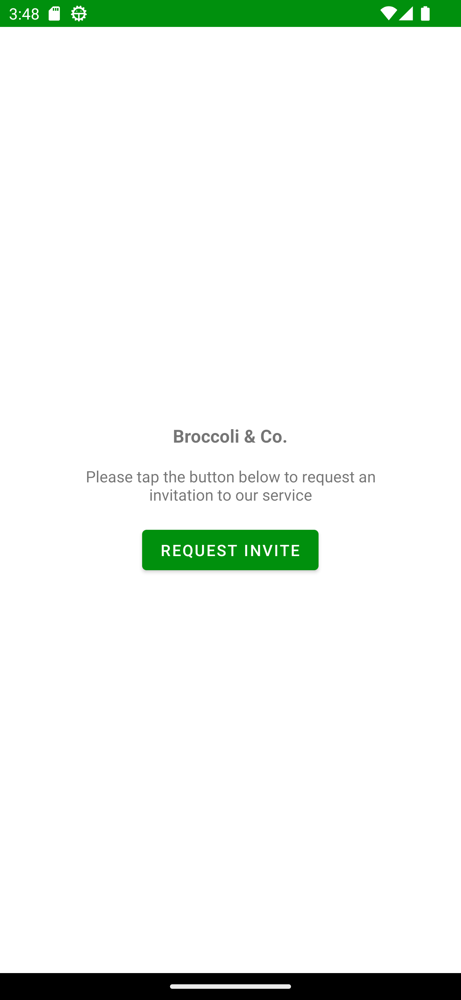
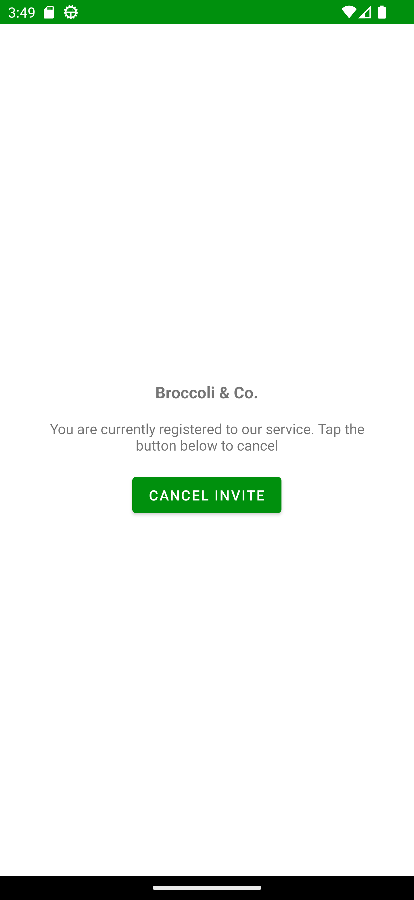
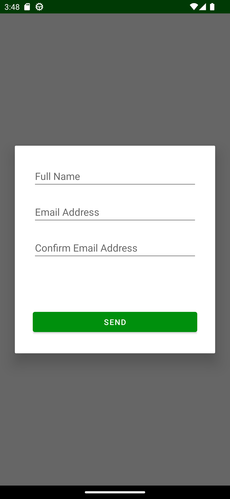
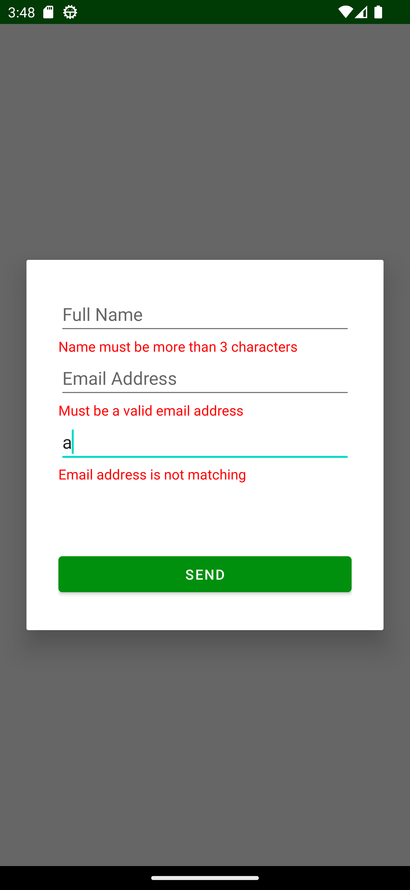
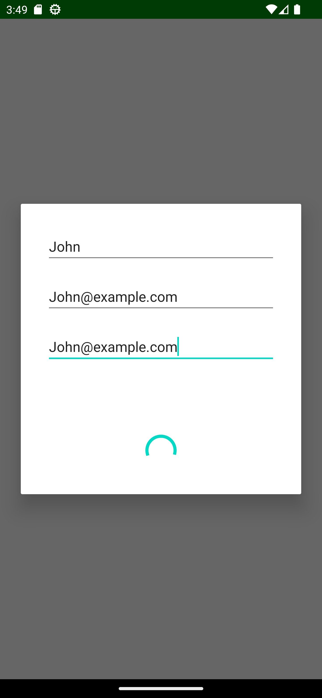
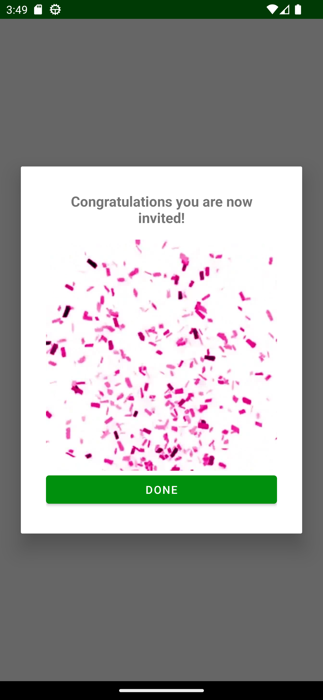
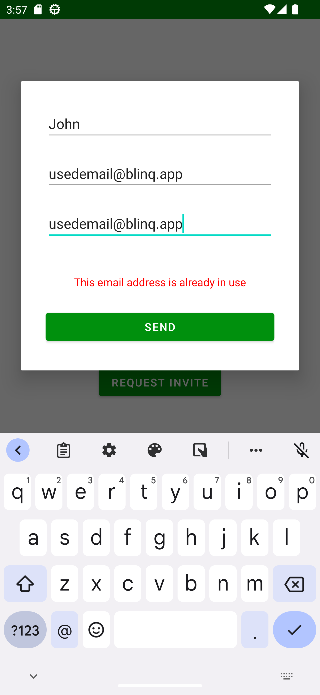
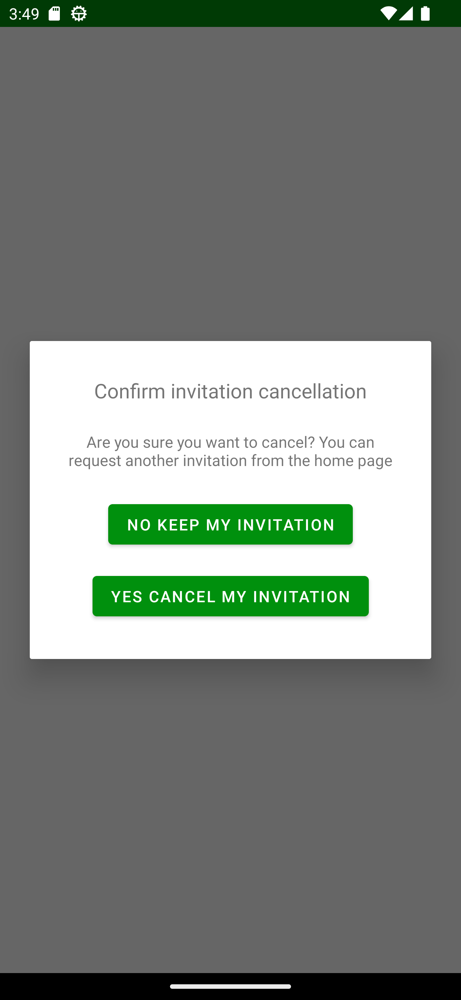
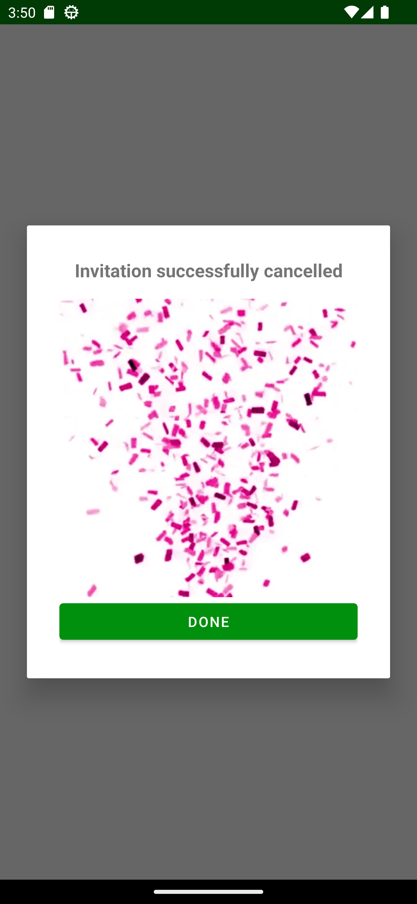
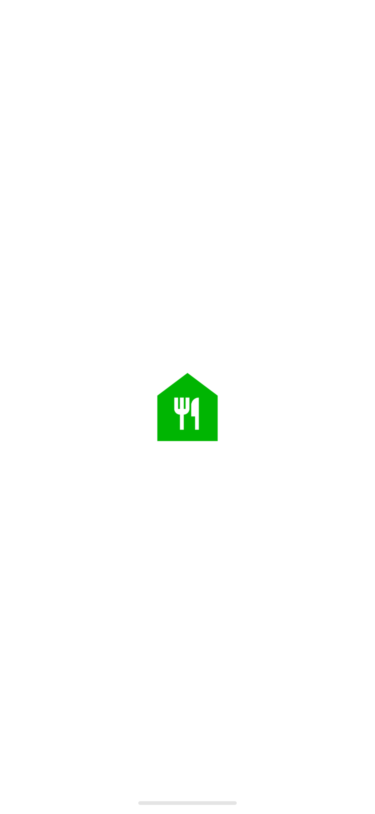

# Request Invite
An app for requesting an invitation to the Broccoli &amp; Co. closed beta service

# Features
- [x] CLEAN Architecture with data and presentation layers
- [x] MVVM Architecture orchestrating UI events with Flows
- [x] Single Activity with fragment based navigation
- [x] Retrofit with kotlinx serialization for HTTP requests
- [x] DataStore for key value user preference storage
- [x] Dagger hilt for dependency injection
- [x] Glide for image processing
- [x] Coroutines for UI events, Retrofit calls, DataStore calls
- [x] Unit testing for view model and retrofit instance
- [x] Instrumentation testing for DataStore

# Layers
- `Data`: DataStore and Retrofit singletons injected with Hilt
  - `local`: DataStore to set and get the invitation status. Check DataStore on start to determine whether to display pre or post invite screens.
  - `remote`: Retrofit with a post function to send user details and returns a Success or Error object with a message that will be displayed.

- `Presentation`: MVVM architecture
  - `view`: Fragment for the pre and post invite screens. Dialogs for the modal forms to request or cancel an invite.
  - `viewmodel`: View Model to orchestrate UI events and validate input fields.

# Screens
- `Pre Invite`:
  - 
- `Post Invite`:
  - 
- `User Details Dialog`:
  - 
- `User Details Valiation Dialog`:
  - 
- `User Details Loading`:
  - 
- `User Details Success`:
  - 
- `User Details Error`:
  - 
- `Cancel Invite Dialog`:
  - 
- `Cancel Invite Success Dialog`:
  - 
- `Splash Screen`:
  - 